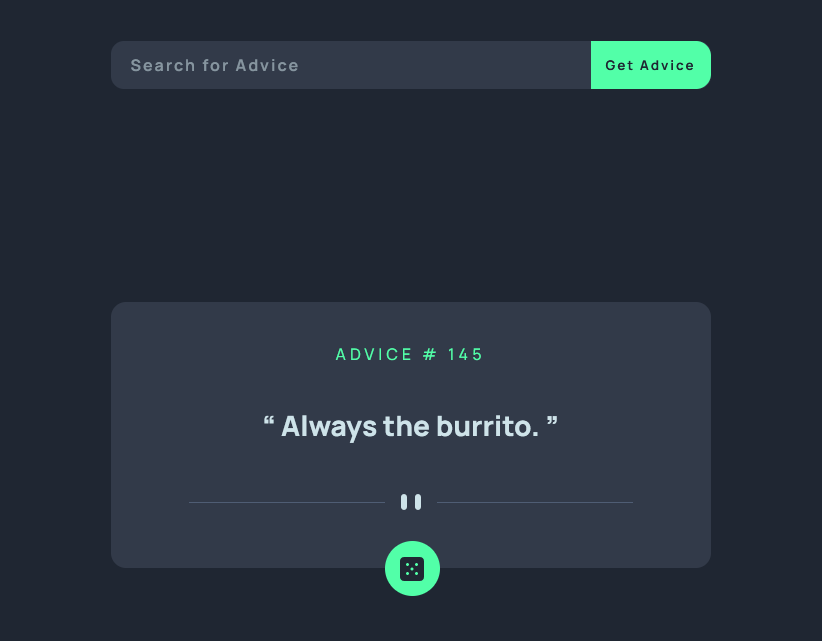

# Frontend Mentor - Advice generator app solution

This my a solution to the [Advice generator app challenge on Frontend Mentor](https://www.frontendmentor.io/challenges/advice-generator-app-QdUG-13db). 

### Screenshot



### Links

- Solution URL: [comming soon]()
- Live Site URL: [Advice Generator App](https://fem-advice-generator-app-seven.vercel.app/)

## Build Notes
- Added a loading spinner for slower networks.
- I wanted to use the `srcset` attribute, so I learned about and used the `<picture>` tag.  It's applied to the divider image.
- Played around with `inset` and `calc()` when positioning the dice button.
- I used Async/Await
- The API offers a search object, I'll apply that soon.

### Something I Learned

Using `<picture>` tag and `srcset` attribute.
```html
<picture>
  <source media="(min-width: 650px)" srcset="./images/pattern-divider-desktop.svg">
  
</picture>
```

Using `inset` instead of `top bottom left right` and `calc()`.
```css
.dice {
  position: absolute;
  inset: calc(100% - 2.7rem) calc(50% - 2.6rem);
  width: 5.5rem;
  height: 5.5rem;
  background-color: var(--neonGreen);
  border-radius: 50%;
  cursor: pointer;
}

.dice img {
  transform: translateY(calc(50% - .25rem));
}
```

## Author
- My Website - [James Bretz (Auddity)](https://auddity.netlify.app/)
- Frontend Mentor Profile - [Auddity](https://www.frontendmentor.io/profile/Auddity)
- Sometimes I post notes on Medium - [Auddity](https://medium.com/@jay.auddity)